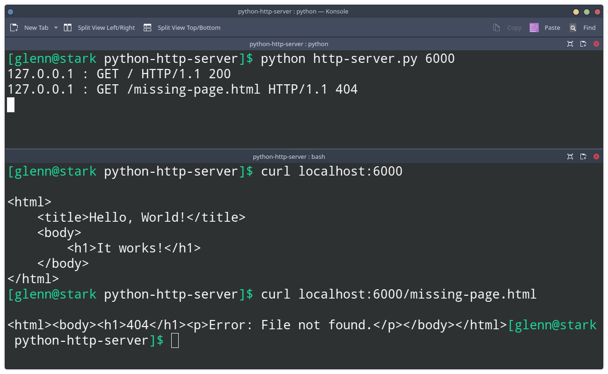

# Bare Python HTTP Server

This code implements a basic HTTP server using Python `socket` Module. This is only for demonstration purposes. DON'T use in production.

At the core, a web server (like **Apache** or **NginX**) listens at some particular port (typically, port 80) for HTTP requests. An HTTP request contains several lines, the first line, called request line, contains the HTTP request method (eg, GET, POST, etc) and the URL of the requested resource and the HTTP version. When a request is made, a web server locates the file specified in the URL. If the file exists, the  web server will create a corresponding HTTP response containing a response line (with status code = `200`, status phrase = `OK`) , some relevant request headers (eg, `Content-Type: text/html` for HTML files), and a body  containing the actual contents of the requested file. If, however, the file requested does not exist in the server, the web server will respond with an error (status code = `400`, status phrase = `NOT_FOUND`) .

### Usage

```python
# python http-server.py PORT
python http-server 6000
```

### Sample Output


